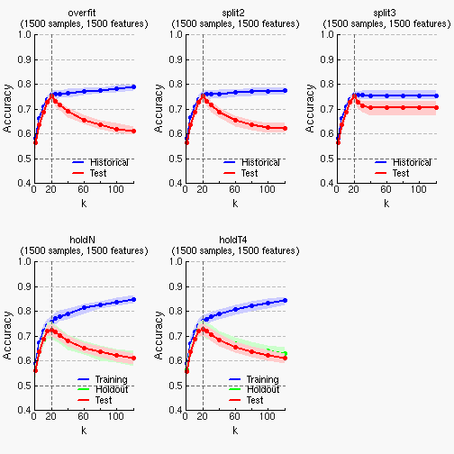

# Rthresholdout

This vignette demonstrates package Rthresholdout. The package provides some core functions for using the holdout approach proposed in a research paper "The reusable holdout: Preserving validity in adaptive data analysis".

The calculation in this vignette applies the reusable holdout on synthetic data. It is based on the examples from the research paper, but also contains some additions.


## Setup

In this section we set up the synthetic dataset. We will work with matrics describing samples and features. 


```r
numsamples = 1500
numfeatures = 1500
numsignals = 20
```

For the reusable holdout, we need to define two additional settings/penalties:


```r
tolerance.factor = 1;
threshold.factor = 4;
```

For this vignette, the threshold.factor will be important - it determines the conditions when an evaluation function will use a holdout and when a background dataset. The other tolerance factor will determine the noise level of the output.

Finally, we will repeat the simulations for a number of replicates and work with a range of models (100 repeats is thorough, but try a smaller number for quicker results)


```r
reps = 100;
krange = c(1, seq(5, 30, by=5), seq(40, 120, by=20))
```


### More setup

Within the simulations, we will make use of some helper objects.

The following object will be used within a loop to describe how the training data should be used


```r
trymethods = c("overfit", "split2", "split3", "holdN", "holdT4")
```

When working with historical data split into two parts, it will be helpful to have vectors containing the sample ids for each part.


```r
temp = floor(seq(1, numsamples, length=3))
S1 = temp[1]:temp[2];
S2 = (temp[2]+1):temp[3];
rm(temp)

temp = floor(seq(1, numsamples, length=4))
Sa = temp[1]:temp[2];
Sb = (temp[2]+1):temp[3];
Sc = (temp[3]+1):temp[4];	
rm(temp)

restypes = c("train", "train.1","train.2", "test")
```

Using such vectors is not particularly elegant, but they will do for this vignette.

## Simulation

Install package Rthresholdout from github 


```r
library("devtools")
install_github("tkonopka/Rthresholdout")
```

```
## Downloading github repo tkonopka/Rthresholdout@master
## Installing Rthresholdout
## '/software/opt/R/R-3.1.2/lib/R/bin/R' --no-site-file --no-environ  \
##   --no-save --no-restore CMD INSTALL  \
##   '/tmp/RtmpoUaXd8/devtools1b5a70be84c9/tkonopka-Rthresholdout-0a3a736'  \
##   --library='/software/opt/R/R-3.1.2/lib/R/library' --install-tests 
## 
## Reloading installed Rthresholdout
```

```r
library("Rthresholdout")
library("Rcssplot")
```

Because the simulation requires generating random datasets, it is a good idea to set the seed. But since we will average over multiple replicates, the aggregate results should not depend on the seed. 


```r
set.seed(39302081)
```


Now let's run the simulation. This code is somewhat long because it contains handling of various types of model learning and evaluation. Roughly, the code creates a synthetic dataset containing mostly random numbers, but also a few features designed to correlate with a signal vector. The code will apply each model building strategy on this dataset, and record the performance on the training data and on a test dataset. 

First we will make an object that will hold performance for each method and for each replicate.


```r
if (!exists("results.raw")) {
  cat("creating results.raw object\n");
  results.raw = list();
  
  ## first create matrices with results for each replicate
  for (method in trymethods) {  
    results.raw[[method]] = list();
    temp = matrix(0, ncol=length(krange), nrow=reps)
    for (nowtype in restypes) {
      results.raw[[method]][[nowtype]] = temp;
    }
    rm(temp)
  }

  results.raw$done = FALSE;
}
```

```
## creating results.raw object
```


In this part, the matrices are filled in. This part may take some time...


```r
if (!results.raw$done) {
  ## then perform the calculations many time (replicates)
  for (i in 1:reps) {
    ## create a dataset (either pure noise or with a signal)
    ds = createRandomSet(numfeatures, numsamples, nbiased=numsignals)

    ## learn models for this dataset using various approaches
    for (method in trymethods) {
      
      if (method=="overfit") {
        set.cors = getFeatureCorrelations(ds$train, ds$train.signal)        
      } else if (method=="split2") {
        set.cors = cbind(
          getFeatureCorrelations(ds$train[,S1], ds$train.signal[S1]),
          getFeatureCorrelations(ds$train[,S2], ds$train.signal[S2])
          );					
      } else if (method=="split3") {
        set.cors = cbind(
          getFeatureCorrelations(ds$train[,Sa], ds$train.signal[Sa]),
          getFeatureCorrelations(ds$train[,Sb], ds$train.signal[Sb]),
          getFeatureCorrelations(ds$train[,Sc], ds$train.signal[Sc])
          );						  
      } else if (method=="holdN") {
        set.cors = getFeatureCorrelations(ds$train[,S1], ds$train.signal[S1])
      } else if (method=="holdT4") {
        set.cors = cbind(
          getFeatureCorrelations(ds$train[,S1],
                                 ds$train.signal[S1]),
          getFeatureCorrelations(ds$train[,S2], ds$train.signal[S2],
                                 dat.bg=ds$train[,S1],
                                 signal.bg=ds$train.signal[S1])
          )        
      } 
      for (j in 1:length(krange)) {      
        weights = getBinaryFeatureWeights(set.cors, krange[j])        
        
        ## use computed weights to predict classes for patients
        ## compare these classes with the true classes
        acc.train = evaluatePredictionAccuracy(
          ds$train.signal, predictFromWeights(ds$train, weights))
        acc.train.1 = evaluatePredictionAccuracy(
          ds$train.signal[S1], predictFromWeights(ds$train[,S1], weights))
        acc.train.2 = evaluatePredictionAccuracy(
          ds$train.signal[S2], predictFromWeights(ds$train[,S2], weights))    
        acc.test = evaluatePredictionAccuracy(
          ds$test.signal, predictFromWeights(ds$test,  weights))
        
        ## record the values in a matrix
        results.raw[[method]][["train"]][i,j] = acc.train;
        results.raw[[method]][["train.1"]][i,j] = acc.train.1;
        results.raw[[method]][["train.2"]][i,j] = acc.train.2;
        results.raw[[method]][["test"]][i,j] = acc.test;
        
      } ## end of loop over k      
    } ## end of loop over methods        
  } ## end of loop over replicates
  
  results.raw$done=TRUE;
  cat("\n")  
}
```

```r
if (!exists("results")) {
  results = list()
  for (method in trymethods) {
    temp = matrix(0, ncol=1+(length(restypes)*3), nrow=length(krange));
    colnames(temp) = c("k",
              paste0(rep(restypes, each=3), c(".low", ".median", ".high")))
    temp[,"k"] = krange;
    for (nowset in restypes) {
      temp[,paste0(nowset,c(".low",".median",".high"))] =
        t(apply(results.raw[[method]][[nowset]], 2,
                quantile, p=c(0.05,0.5,0.95)))
    }
    results[[method]] = temp;
    rm(temp)
  }
}
```

After all the calculation is complete, we can plot performance of each strategy. The plot function is defined in a separate file. The styling is done through package Rcssplot. 


```r
source("Rthresholdout-plot.R")
mystyle = Rcss("Rthresholdout.Rcss")
RcssSetDefaultStyle(mystyle)

plotcolors = c("#0000ff","#00ff00","#ff0000")
plotcolors.bg = c("#ccccff","#ccffcc","#ffcccc")

topdf = "nopdf"
if (topdf=="pdf") {
  plotcolors.bg = paste0(plotcolors,"28")	
  filename = paste0("Rthresholdout-",
                  numsamples,"-",numfeatures,"-",numsignals,".pdf")
  Rcsspdf(file=filename)
  Rcsspar(mfrow=c(2,3), Rcssclass="pdf")
} else {
  Rcsspar(mfrow=c(2,3))
}
for (nowmethod in trymethods) {
  nowmain = paste0(nowmethod, "  (",
                  numsamples," samples, ",numfeatures," features)")
  if (nowmethod=="overfit" | nowmethod=="split2" | nowmethod=="split3") {
    plotHresults(results[[nowmethod]], types=c("train","test"), 
        col=plotcolors[c(1,3)], bgcol=plotcolors.bg[c(1,3)],
        main=nowmain, Rcssclass=topdf)
  } else {		    
    plotHresults(results[[nowmethod]], main=nowmain,
        col=plotcolors, bgcol=plotcolors.bg, Rcssclass=topdf)
  }
}
if (topdf=="pdf") {
  dev.off()
}
```

 

That's all. 

